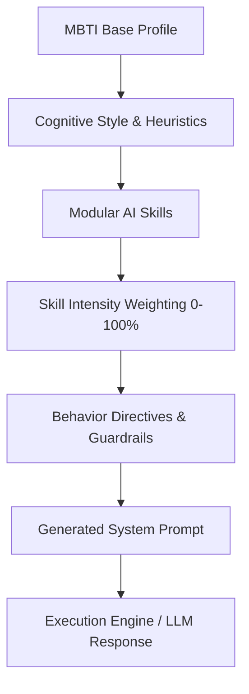

# MBTI AI Skills

> **Build the way your AI thinks.**

Explore 16 AI interaction profiles, experiment with modular cognitive Skills, and compose your own custom AI cognitive architecture — deployable anywhere from system prompts to autonomous agent systems.

[](https://opensource.org/licenses/MIT)
[](https://github.com/mbti-ai-skills/mbti-ai-skills/actions/workflows/deploy.yml)
[](https://vitejs.dev)

---

## 📑 Table of Contents

- [Overview](#overview)
- [Why This Project Exists](#why-this-project-exists)
- [Important Philosophy & Disclaimer](#important-philosophy--disclaimer)
- [Architecture & How It Works](#architecture--how-it-works)
- [The 16 MBTI-Inspired Profiles](#the-16-mbti-inspired-profiles)
- [Modular Skills System](#modular-skills-system)
- [See the Difference (Comparative Demo)](#see-the-difference)
- [Core Features](#core-features)
  - [AI Mind Builder](#ai-mind-builder)
  - [Side-by-Side Comparison Matrix](#side-by-side-comparison-matrix)
  - [Cognitive Test Lab](#cognitive-test-lab)
  - [Shareable URL & JSON Import/Export](#shareable-url--json-importexport)
- [Real AI Provider Integration](#real-ai-provider-integration)
- [Community Skills Guide](#community-skills-guide)
- [Installation & Local Development](#installation--local-development)
- [GitHub Pages Deployment](#github-pages-deployment)
- [Project Roadmap](#project-roadmap)
- [License](#license)

---

## 🌟 Overview

Large Language Models typically respond with a generic "helpful assistant" tone. In complex workflows — debugging concurrency bugs, architecting multi-year technical strategies, facilitating empathetic team mediation, or exploring radical creative concepts — different cognitive angles yield vastly superior results.

**MBTI AI Skills** is an open-source framework that maps MBTI-inspired cognitive preferences into **discrete, modular AI interaction profiles and reusable skill sets**.

Instead of treating MBTI as a rigid diagnosis, MBTI AI Skills treats each profile as a **configurable interaction design pattern** that you can customize, scale by intensity (0–100%), and export as production-ready system prompts.

---

## 💡 Why This Project Exists

1. **AI Persona Customization is Often Fluffy**: Prompting an AI to "act like a senior engineer" or "be creative" often fails to enforce consistent cognitive heuristics. MBTI AI Skills provides structured behavior directives, reasoning constraints, and verification protocols.
2. **Cognitive Diversity Matters**: Different problems require different cognitive primitives. Tactical failure isolation (ISTP-style) is fundamentally different from theoretical hypothesis pruning (INTP-style) or long-term dependency mapping (INTJ-style).
3. **Composability**: You aren't locked into 16 static types. You can combine an *INTP* base with *Tactical (90%)*, *Research (80%)*, and *Empathy (50%)* to build a precision technical investigator with user sensitivity.

---

## ⚖️ Important Philosophy & Disclaimer

> [!IMPORTANT]
> **MBTI AI Skills is an experimental framework for exploring AI interaction styles.**
> 
> MBTI should **not** be treated as a scientifically validated measure of human intelligence, psychological capability, or professional aptitude. The profiles in this project are **configurable design patterns and interaction metaphors**, not psychological diagnoses.
> 
> In this project:
> - We **never** say: *"ISTP people always act like X."*
> - We **always** say: *"An ISTP-inspired AI configuration prioritizes concrete failure-point diagnosis..."*

---

## 🧠 Architecture & How It Works



### The Flow:
1. **Base Profile**: Establishes core worldview, cognitive posture, and default problem-solving heuristics.
2. **AI Skill Composition**: Augments the base with specialized modules (e.g., *Analytical*, *Tactical*, *Debate*, *Troubleshooting*).
3. **Skill Intensity**: Sets continuous weight (0–100%) which scales the assertiveness and depth of each behavior in the prompt.
4. **Behavior Directives**: Translates weights into operational instructions, step-by-step reasoning patterns, and epistemic boundaries (distinguishing known facts from speculation).
5. **System Prompt**: Produces a clean, optimized system prompt with token estimations.

---

## 🏛️ The 16 MBTI-Inspired Profiles

The framework models all 16 profiles grouped by cognitive category:

| Category | Type | Name | Cognitive Posture | Primary Recommended Skills |
| :--- | :--- | :--- | :--- | :--- |
| **Analysts** | `INTJ` | The Architect | Systems-oriented, strategic, long-range | Strategic, Analytical, Optimization, Research |
| **Analysts** | `INTP` | The Thinker | Analytical, exploratory, first-principles logic | Analytical, Research, Experimental, Troubleshooting |
| **Analysts** | `ENTJ` | The Commander | Executive strategist, decisive execution | Strategic, Optimization, Structured, Debate |
| **Analysts** | `ENTP` | The Debater | Divergent challenger, rapid hypothesis space | Brainstorming, Debate, Experimental, Creative |
| **Diplomats** | `INFJ` | The Advocate | Visionary empath, holistic systemic meaning | Empathy, Strategic, Research, Analytical |
| **Diplomats** | `INFP` | The Mediator | Authentic idealist, values-driven creativity | Creative, Empathy, Brainstorming, Experimental |
| **Diplomats** | `ENFJ` | The Protagonist | Collaborative leader, collective alignment | Empathy, Strategic, Structured, Brainstorming |
| **Diplomats** | `ENFP` | The Campaigner | Possibility innovator, cross-domain connection | Brainstorming, Creative, Empathy, Experimental |
| **Sentinels** | `ISTJ` | The Inspector | Methodical, verified process, audit precision | Structured, Troubleshooting, Research, Optimization |
| **Sentinels** | `ISFJ` | The Protector | Meticulous care, practical detail, reliable | Empathy, Structured, Troubleshooting, Research |
| **Sentinels** | `ESTJ` | The Executive | Standards enforcement, accountability, cadence | Structured, Optimization, Troubleshooting, Debate |
| **Sentinels** | `ESFJ` | The Consul | Community organizer, inclusive clarity | Empathy, Structured, Brainstorming, Optimization |
| **Explorers** | `ISTP` | The Virtuoso | Tactical troubleshooter, concrete failure isolation | Tactical, Troubleshooting, Experimental, Optimization |
| **Explorers** | `ISFP` | The Adventurer | Experiential experimenter, aesthetic nuance | Creative, Experimental, Empathy, Tactical |
| **Explorers** | `ESTP` | The Entrepreneur | High-stakes pragmatist, rapid real-world iteration | Tactical, Experimental, Brainstorming, Optimization |
| **Explorers** | `ESFP` | The Entertainer | Spontaneous creator, engaging human energy | Creative, Brainstorming, Empathy, Experimental |

---

## 🧩 Modular Skills System

Skills are independently composable building blocks that can be attached to any profile:

1. **Analytical Skill** — Decomposes complex problems, exposes hidden assumptions, searches for contradictions, compares competing hypotheses.
2. **Tactical Skill** — Focuses on immediate practical problems, isolates failure points quickly, tests concrete fixes, minimizes abstraction.
3. **Strategic Skill** — Defines long-term objectives, maps dependencies, builds multi-stage roadmaps, optimizes resource allocation.
4. **Brainstorming Skill** — Generates wide solution spaces without premature judgment, combines unrelated domains, maximizes divergent breadth.
5. **Troubleshooting Skill** — Separates symptoms from root causes, isolates variables, tests hypotheses methodically, provides verification procedures.
6. **Creative Skill** — Employs divergent thinking, reframes constraints into opportunities, utilizes generative metaphor and unexpected connections.
7. **Empathy / Human Context Skill** — Attends to emotional and interpersonal nuance, adapts tone, explains difficult concepts sensitively.
8. **Structured Skill** — Enforces checklists, organizes hierarchies, adheres to proven procedures, maintains format consistency.
9. **Experimental Skill** — Formulates testable hypotheses, designs minimal controlled tests, updates beliefs based on empirical signal.
10. **Debate Skill** — Actively pressure-tests assumptions, formulates steelmanned counterarguments, exposes logical fallacies.
11. **Optimization Skill** — Identifies bottlenecks, calculates trade-offs, eliminates redundant complexity, benchmarks alternatives.
12. **Research Skill** — Separates verified facts from assumptions, identifies missing info, evaluates source credibility.

---

## 🔍 See the Difference

**Question:**
> *"My application keeps crashing randomly. How should I debug it?"*

### 🛠️ ISTP-Inspired Configuration (Tactical + Troubleshooting)
```
Approach: Reproduce → Isolate Variable → Binary Search Code Path → Test Concrete Fix

"First: reproduce it. If you can't reproduce it on demand, add logging that captures
process state at entry points — memory, open socket handles, payload sizes. Run under load.
Once reproducible: binary search the code path. Disable half the suspected routines.
Find the exact line triggering the crash. Fix that specific invariant. Test."
```

### 🔬 INTP-Inspired Configuration (Analytical + Research + Experimental)
```
Approach: Deconstruct "Random" → Analyze Crash Signatures → Model State Dependencies → Test Hypotheses

"The premise that it's 'random' is an assumption to discard. Apparent randomness in software
is almost always deterministic behavior contingent on unobserved state — concurrency race
conditions, thread pool exhaustion, or memory corruption. Deconstruct the crash signature:
is it a SIGSEGV, OOM, or unhandled promise rejection? Test each hypothesis systematically."
```

### ⚡ ENTP-Inspired Configuration (Brainstorming + Debate + Creative)
```
Approach: Generate Competing Hypotheses → Challenge Architecture Premises → Explore Unconventional Causes

"Let's expand the hypothesis space before touching code. Beyond the standard memory leak:
Could an external API payload change only on leap-second or cache TTL expirations?
What if the issue is in the runtime VM or kernel socket recycling under specific MTU sizes?
Flip the problem: under what exact conditions does the app NEVER crash? That isolates the space."
```

### ♟️ INTJ-Inspired Configuration (Strategic + Systems Architecture + Optimization)
```
Approach: Map System Architecture → Identify Failure Boundaries → Instrument Layers → Systematic Debug Plan

"Do not patch isolated symptoms. Map the architecture to locate every boundary where
untyped state enters the system. Instrument telemetry across all tiers (network, database,
application runtime). Rank failure hypotheses by Probability × Severity. Execute a phased
debugging strategy and resolve at the architectural level to eliminate the entire class of failures."
```

---

## 🛠️ Core Features

### 1. AI Mind Builder (`/builder`)
- **Step 1: Base Profile Selector** — Select from all 16 MBTI configurations.
- **Step 2: Modular Skills Selector** — Add or remove any of the 12 Skills.
- **Step 3: Intensity Sliders (10–100%)** — Fine-tune how strongly each cognitive skill expresses itself.
- **Step 4: Personalization** — Set communication tone and append custom directives.
- **Interactive System Prompt Preview** — View live syntax-highlighted system prompt, char count, and estimated tokens.
- **Local Persistence** — Automatically saves active profile and saved profiles in `localStorage`.

### 2. Side-by-Side Comparison Matrix (`/compare`)
- Select up to **4 AI profiles** simultaneously.
- Choose from **10 curated benchmark problems** or enter custom prompts.
- Switch between **Side-by-Side Response Panels** and **Detailed Comparative Matrix** (Thinking Style, Problem Approach, Communication, Primary Skills).

### 3. Cognitive Test Lab (`/lab`)
- Test your configured AI mind in real-time.
- Visual breakdown of the **Cognitive Trajectory** (multi-step reasoning approach) alongside simulated outputs.
- Pluggable provider architecture with zero API keys required for testing.

### 4. Shareable URLs & JSON Export/Import
- **No-Backend Sharing**: The full profile configuration is encoded directly into URL query parameters (`/builder?profile=...`).
- **JSON Standard**: Export and import `.json` configurations for version control and sharing.

```json
{
  "name": "Analytical Tactical AI",
  "baseType": "INTP",
  "skills": [
    { "id": "analytical", "intensity": 90 },
    { "id": "tactical", "intensity": 75 },
    { "id": "troubleshooting", "intensity": 85 }
  ],
  "communicationPreference": "concise, code-first",
  "schema": "mbti-ai-skills/v1"
}
```

---

## 🔌 Real AI Provider Integration

The project includes an extensible `AIProvider` interface (`src/engine/aiProvider.ts`):

```typescript
export interface AIProvider {
  type: AIProviderType;
  name: string;
  generate(systemPrompt: string, userMessage: string): Promise<string>;
}
```

- **Simulation Mode** (Default, client-side, zero keys required).
- Architectural hooks prepared for:
  - **OpenAI** (`gpt-4o`, `o3-mini`)
  - **Anthropic** (`claude-3-5-sonnet`)
  - **Google Gemini** (`gemini-2.0-flash`)
  - **OpenRouter** (universal API gateway)
  - **Local LLM** (Ollama, LM Studio via localhost CORS)

---

## 🤝 Community Skills Guide

Anyone can contribute a new cognitive Skill! Skills are decoupled from the UI engine.

See the complete guide and specification in [`skills/community/README.md`](skills/community/README.md).

To add a skill:
1. Create `skills/community/<your-skill-id>.json`.
2. Define `id`, `name`, `description`, `behaviors`, `compatibleProfiles`, and `tags`.
3. Submit a Pull Request.

---

## 💻 Installation & Local Development

### Prerequisites
- Node.js 18+ or 20+
- npm 9+

### Setup

```bash
# 1. Clone the repository
git clone https://github.com/mbti-ai-skills/mbti-ai-skills.git
cd mbti-ai-skills

# 2. Install dependencies
npm install

# 3. Start development server
npm run dev
```

Open [http://localhost:5173](http://localhost:5173) in your browser.

### Scripts
- `npm run dev` — Start Vite local dev server with HMR.
- `npm run build` — TypeScript compile (`tsc -b`) and Vite production bundle.
- `npm run preview` — Locally preview production build.

---

## 🚀 GitHub Pages Deployment

The repository includes a ready-to-run GitHub Actions workflow in `.github/workflows/deploy.yml`.

### Enabling GitHub Pages:
1. Push your repository to GitHub (`main` branch).
2. Go to your repository on GitHub → **Settings** → **Pages**.
3. Under **Build and deployment** → **Source**, select **GitHub Actions**.
4. The `.github/workflows/deploy.yml` workflow will automatically build and publish the site with SPA deep-routing support.

---

## 🗺️ Project Roadmap

- [x] **v0.1 — Core Framework**
  - [x] 16 MBTI-inspired AI cognitive profiles
  - [x] 12 modular reusable Skills with intensity sliders (10–100%)
  - [x] Responsive dark-mode UI with cyberpunk aesthetics
  - [x] AI Mind Builder with live prompt generation & token estimation
  - [x] Side-by-side profile comparison & matrix view
  - [x] Interactive Test Lab with simulated cognitive flow
  - [x] Shareable profile URLs (URL-safe base64 state encoding)
  - [x] JSON configuration import/export & LocalStorage persistence
  - [x] "Surprise Me" randomized profile generator
  - [x] GitHub Pages automated deployment workflow
- [ ] **v0.2 — Extended Skills & Benchmarking**
  - [ ] Community skill dynamic loader
  - [ ] Custom benchmark challenge suite
- [ ] **v0.3 — Live LLM Execution**
  - [ ] Client-side API key configuration for OpenAI, Anthropic, Gemini, OpenRouter
  - [ ] Streaming response support in Test Lab
- [ ] **v1.0 — CLI & Agent Framework Integration**
  - [ ] `npx mbti-ai-skills` CLI to export prompt files directly to LangChain, LlamaIndex, or Claude Desktop

---

## 📄 License

Distributed under the **MIT License**. See `LICENSE` for details.
