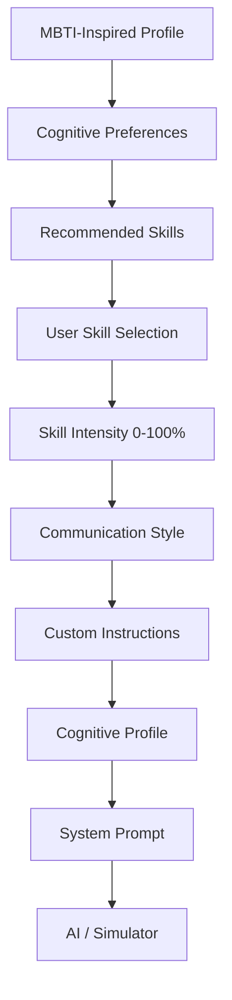

# MBTI AI Skills — V1.1

> **Build the way your AI thinks.**

An open-source cognitive framework for composing, testing, and comparing modular AI interaction profiles inspired by MBTI preferences.

[](https://opensource.org/licenses/MIT)
[](https://github.com/Imposter-zx/MBTI-AI-SKILLS/actions/workflows/deploy.yml)
[](https://vitejs.dev)

---

## 📑 Table of Contents

- [The Core Philosophy](#the-core-philosophy)
- [Important Scientific & Psychological Disclaimer](#important-scientific--psychological-disclaimer)
- [Terminology & Architecture](#terminology--architecture)
- [Central Architecture Workflow](#central-architecture-workflow)
- [The 16 MBTI-Inspired Base Profiles](#the-16-mbti-inspired-base-profiles)
- [12 Modular Cognitive Skills](#12-modular-cognitive-skills)
- [Cognitive Profiles — The V1.1 System](#cognitive-profiles--the-v11-system)
- [Continuous Skill Intensity Engine](#continuous-skill-intensity-engine)
- [Compare Lab](#compare-lab)
- [Test Lab (Rule-Based Simulation)](#test-lab-rule-based-simulation)
- [System Prompt Generation & Token Estimation](#system-prompt-generation--token-estimation)
- [Serialization & URL Sharing](#serialization--url-sharing)
- [AI Provider Architecture](#ai-provider-architecture)
- [Community Skills Guide](#community-skills-guide)
- [Installation & Verification Pipeline](#installation--verification-pipeline)
- [GitHub Pages Deployment](#github-pages-deployment)
- [Project Roadmap](#project-roadmap)
- [License](#license)

---

## 💡 The Core Philosophy

```text
MBTI is not the AI's identity.

MBTI is the starting point.

Skills are modular.

Intensity is adjustable.

The user builds the final Cognitive Profile.
```

Most AI personas rely on vague instructions like *"be creative"* or *"be a senior engineer"*. **MBTI AI Skills** provides an engineering framework where cognitive heuristics, problem decomposition styles, and behavioral weights are treated as **discrete, composable software modules**.

Instead of treating MBTI as a scientific personality truth, this project treats it as a **rich design pattern library of cognitive heuristics**.

---

## ⚖️ Important Scientific & Psychological Disclaimer

> [!IMPORTANT]
> **MBTI AI Skills is an experimental software framework inspired by commonly described MBTI preferences. It is not a psychological diagnostic tool and does not claim that MBTI determines intelligence, professional ability, or fixed behavior. AI profiles are configurable interaction patterns designed for experimentation.**
>
> In this project:
> - ❌ We **never** claim: *"ISTP people always act like X."*
> - ✅ We **always** state: *"An ISTP-inspired AI profile emphasizes concrete failure isolation, physical invariants, and minimal speculative abstraction."*

---

## 📚 Terminology & Architecture

To avoid ambiguity, this project strictly distinguishes between four concepts:

| Term | Definition | Example |
| :--- | :--- | :--- |
| **MBTI Profile** | A predefined starting configuration offering baseline heuristics. | `INTP`, `ISTP`, `ENTJ` |
| **Skill** | An independent, reusable behavioral module that can attach to any profile. | `Analytical`, `Tactical`, `Debate` |
| **Cognitive Profile** | A user-created combination of a base profile, selected skills, intensities (0–100%), communication style, and custom invariants. | `INTP + Analytical (95%) + Research (85%) + Technical Tone` |
| **System Prompt** | The generated, formatted instruction set used to configure an LLM or autonomous agent. | Markdown text ready for ChatGPT, Claude, Cursor, Ollama |

---

## 🧠 Central Architecture Workflow



### The 8-Step Journey:
1. **Choose a starting style** — Select one of 16 MBTI-inspired profiles.
2. **Explore Skills** — Browse 12 independent cognitive modules.
3. **Mix & Order Skills** — Add, remove, search, and reorder skill priority.
4. **Adjust Intensity** — Continuous 0% to 100% sliders.
5. **Calibrate Communication** — Concise, Balanced, Detailed, Technical, Simple, Socratic, Direct, or Exploratory.
6. **Generate Cognitive Profile** — Auto-named profile with explicit behavior and trajectory breakdown.
7. **Test & Compare** — Simulate in the Lab or compare against other profiles side-by-side.
8. **Export / Share** — Copy system prompt, export JSON, or share via URL.

---

## 🏛️ The 16 MBTI-Inspired Base Profiles

All 16 profiles are fully modeled across 4 categories:

| Category | Type | Name | Cognitive Stance | Primary Recommended Skills |
| :--- | :--- | :--- | :--- | :--- |
| **Analysts** | `INTJ` | The Architect | Long-range systems architecture & strategic roadmapping | Strategic, Analytical, Optimization, Research |
| **Analysts** | `INTP` | The Thinker | First-principles logic & hypothesis deconstruction | Analytical, Research, Experimental, Troubleshooting |
| **Analysts** | `ENTJ` | The Commander | Decisive executive execution & milestone delivery | Strategic, Optimization, Structured, Debate |
| **Analysts** | `ENTP` | The Debater | Divergent challenger & contrarian hypothesis search | Brainstorming, Debate, Experimental, Creative |
| **Diplomats** | `INFJ` | The Advocate | Holistic systemic meaning & purpose alignment | Empathy, Strategic, Research, Analytical |
| **Diplomats** | `INFP` | The Mediator | Values-aligned exploration & creative depth | Creative, Empathy, Brainstorming, Experimental |
| **Diplomats** | `ENFJ` | The Protagonist | Collaborative stakeholder alignment & vision synthesis | Empathy, Strategic, Structured, Brainstorming |
| **Diplomats** | `ENFP` | The Campaigner | Cross-domain innovation & possibility expansion | Brainstorming, Creative, Empathy, Experimental |
| **Sentinels** | `ISTJ` | The Inspector | Verified standard procedures, audit rigor, precision | Structured, Troubleshooting, Research, Optimization |
| **Sentinels** | `ISFJ` | The Protector | Meticulous operational care & supportive consistency | Empathy, Structured, Troubleshooting, Research |
| **Sentinels** | `ESTJ` | The Executive | Standards enforcement, metrics, and operational cadence | Structured, Optimization, Troubleshooting, Debate |
| **Sentinels** | `ESFJ` | The Consul | Community coordination & practical stakeholder support | Empathy, Structured, Brainstorming, Optimization |
| **Explorers** | `ISTP` | The Virtuoso | Tactical isolation of failure points & practical fixes | Tactical, Troubleshooting, Experimental, Optimization |
| **Explorers** | `ISFP` | The Adventurer | Hands-on sensory nuance & experiential tuning | Creative, Experimental, Empathy, Tactical |
| **Explorers** | `ESTP` | The Entrepreneur | Rapid real-world prototyping & situational feedback | Tactical, Experimental, Brainstorming, Optimization |
| **Explorers** | `ESFP` | The Entertainer | Engaging human momentum & accessible execution | Creative, Brainstorming, Empathy, Experimental |

---

## 🧩 12 Modular Cognitive Skills

Skills are independent from MBTI. Any profile can be augmented with any combination of skills:

1. **Analytical** — Decomposes complex systems, exposes unstated premises, tests logical contradictions.
2. **Tactical** — Focuses on immediate execution paths, isolates failure points, minimizes abstraction.
3. **Strategic** — Maps multi-stage roadmaps, defines long-term objectives, manages dependencies.
4. **Brainstorming** — Expands the hypothesis space without premature pruning, connects disparate fields.
5. **Troubleshooting** — Separates symptoms from root causes, isolates variables with minimal reproduction paths.
6. **Creative** — Divergent lateral thinking, reframing constraints as generative opportunities.
7. **Empathy** — Calibrates for human context, stakeholder impact, team dynamics, and clear tone.
8. **Structured** — Implements verified checklists, standardized workflows, hierarchical documentation.
9. **Experimental** — Formulates falsifiable hypotheses, builds small empirical probes, updates on signal.
10. **Debate** — Steelmans counterarguments, pressure-tests consensus assumptions, checks fallacies.
11. **Optimization** — Profiles execution bottlenecks, analyzes performance vs. complexity trade-offs.
12. **Research** — Separates empirical evidence from conjecture, evaluates source credibility.

---

## 🎛️ Continuous Skill Intensity Engine

In MBTI AI Skills, **intensity is not cosmetic**. Continuous 0–100% values modulate the phrasing and assertiveness of behavior directives:

| Intensity Tier | Weight Range | Behavioral Directive Phrasing |
| :--- | :--- | :--- |
| **Core Driver** | **90% – 100%** | *"Strongly prioritize [behavior]..."* |
| **Active Modifier** | **60% – 89%** | *"Regularly use [behavior]..."* |
| **Situational** | **30% – 59%** | *"Consider [behavior] when useful..."* |
| **Minimal** | **0% – 29%** | *"Use [behavior] only when strictly appropriate..."* |

---

## ⚖️ Compare Lab (`/compare`)

Compare up to **4 configurations** side-by-side on any challenge or benchmark problem.

### Key Principles:
- **No "Winners", No Rankings**: The framework never declares a profile "superior". Different profiles optimize for different constraints (e.g. speed, logical depth, resilience, or empathy).
- **Compare Cognitive Profiles, Not Just MBTI**: Compare base profiles or rich combinations like:
  - `INTP + Analytical (95%) + Research (85%)` vs. `ISTP + Tactical (95%) + Troubleshooting (90%)`.
- **Pre-configured Showdowns**: Instant 1-click presets for *Deep Debugging* and *Strategic Innovation*.
- **Two Views**: Side-by-Side Cognitive Response Cards and a Divergence Matrix.

---

## 🔬 Test Lab (Rule-Based Simulation)

Located at `/lab`, this interactive environment visualizes cognitive trajectories:

- **Transparent Labeling**: Explicitly marked as a **rule-based behavioral simulation** (illustrating cognitive trajectories, not live LLM reasoning).
- **Decomposition Path**: Displays the step-by-step reasoning trajectory (e.g., *Understand → Deconstruct → Hypothesize → Validate → Conclude*).
- **Multi-Provider Architecture**: Simulation Mode works out of the box with zero keys.

---

## 📄 System Prompt Generation & Token Estimation

The builder dynamically generates optimized system prompts ready for deployment in AI tools:

```text
You are an AI configured with an experimental INTP-inspired Cognitive Profile.
This configuration is a design pattern inspired by commonly described MBTI preferences...

Primary cognitive priorities:
- Analyze problems logically from first principles.
- Deconstruct system architecture and state assumptions.
- Maintain epistemic rigor: distinguish facts from speculative hypotheses.

Active Skills:
- Analytical Skill — 95% [Core Driver]: Strongly prioritize decomposing problems into logical primitives...
- Research Skill — 85% [Active Modifier]: Regularly use evidence-based assessments...

Communication style:
Technical: Use precise terminology, formal architectural descriptions, and structured code.

Problem-solving workflow:
1. Understand user objective and constraints.
2. Decompose problem into logical primitives.
3. Expose unstated premises and examine assumptions.
4. Separate empirically verified facts from theoretical speculation.
5. Present a reasoned, actionable conclusion.
```

---

## 📦 Serialization & URL Sharing

- **Zero-Backend URL Sharing**: Configurations are encoded into URL query parameters (`/builder?profile=...`).
- **Resilient & Versioned**: Invalid or corrupt URL strings are caught gracefully without crashing the UI.
- **JSON Standard**: Export and import `.json` configurations:

```json
{
  "version": 1,
  "schema": "mbti-ai-skills/v1.1",
  "name": "Analytical Tactical AI",
  "baseType": "INTP",
  "skills": [
    { "skillId": "analytical", "intensity": 95 },
    { "skillId": "tactical", "intensity": 65 }
  ],
  "communicationStyle": "Technical"
}
```

---

## 🔌 AI Provider Architecture

```text
React Frontend (Vite)
       ↓
Edge Function / Backend Proxy
       ↓
AI Provider (OpenAI, Anthropic, Gemini, OpenRouter, Local LLM)
```

For security, **no API keys are stored or exposed in the frontend**. The public web deployment runs in zero-dependency Simulation Mode. When connecting live LLMs, API calls must be proxied through an edge function or authenticated backend.

---

## 🤝 Community Skills Guide

Anyone can contribute a cognitive Skill! Skills are decoupled from the UI engine.

See [`skills/community/README.md`](skills/community/README.md) for the contribution guide and schema.

---

## 💻 Installation & Verification Pipeline

```bash
# 1. Clone repository
git clone https://github.com/Imposter-zx/MBTI-AI-SKILLS.git
cd MBTI-AI-SKILLS

# 2. Install dependencies
npm install

# 3. Run typecheck
npm run typecheck

# 4. Run verification tests
npm run test

# 5. Build for production
npm run build

# 6. Start local dev server
npm run dev
```

---

## 🚀 GitHub Pages Deployment

Configured via `.github/workflows/deploy.yml`:
- Automated build on push to `main`.
- `VITE_BASE_PATH` support for custom GitHub Pages URLs.
- SPA `dist/404.html` fallback ensuring deep-route refreshes (`/types/intp`, `/builder`, `/compare`, `/lab`) never return 404.

---

## 🗺️ Project Roadmap

- [x] **v1.0 — Core Framework**: 16 MBTI profiles, 12 skills, simulation mode, local storage.
- [x] **v1.1 — Cognitive Profile Upgrade**:
  - First-class `CognitiveProfile` model and dynamic naming.
  - Continuous 0–100% intensity tiers modulating behavior wording.
  - 8 communication postures (Concise, Balanced, Detailed, Technical, Simple, Socratic, Direct, Exploratory).
  - Multi-profile comparison (compare custom cognitive profiles side-by-side).
  - Versioned schema, corruption resilience, and automated verification suite.
- [ ] **v1.2 — Community Registry**: Dynamic GitHub API loader for community skills.
- [ ] **v2.0 — CLI & Multi-Agent Export**: `npx mbti-ai-skills export --target langchain|crewai|claude`.

---

## 📄 License

Distributed under the **MIT License**.
